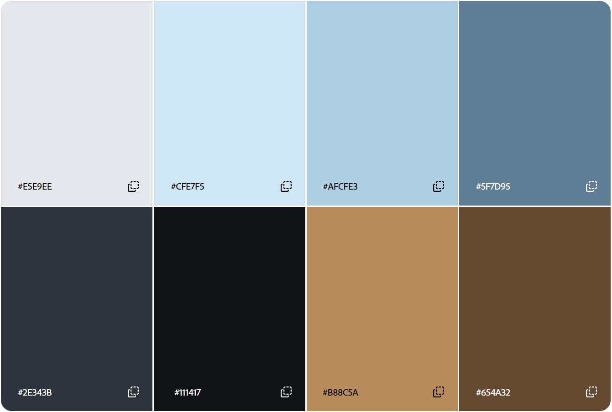
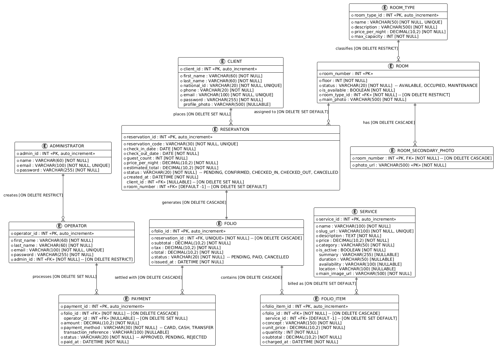

# Atlan Suites — Angular Frontend


Atlan Suites is a hotel management project developed for the Web Development course. This repository contains the migration of its public website and room-type management screens to **Angular 19**.

The previous application uses Spring Boot and Thymeleaf. This frontend runs independently: the current sprint targets the landing page and room-type CRUD with hardcoded data. A backend connection is not implemented or required for this sprint.

## Design and visual identity

- [Figma design](https://www.figma.com/design/AzKmb3UaMsc4t8JZCZXiL4/AtlanSuites?node-id=0-1&t=IUIAEeybnugZna8y-1)
- [Interactive design](https://pants-toggle-56795002.figma.site)

### Color palette



## Current sprint

| Area | Completed | Remaining |
| --- | --- | --- |
| Project setup | Angular 19, standalone components, SCSS, strict TypeScript and routing; SSR disabled | — |
| Landing page | Header with integrated navigation and footer | Migrate the remaining content and interactions |
| Domain models | Ten entity interfaces and four string enums | — |
| Room-type pages | Routes and empty list, detail and shared create/edit page components | Implement their templates and behavior |
| Mock data and service | Services directory reserved | Create the hardcoded collection and CRUD service |
| Room-type CRUD | Component scaffolding | List, view, create, edit and delete; form validation |
| Integration | Build and type-check commands available | Connect the screens to the service and verify the complete flow |

Only the landing page currently displays the header and footer. Its main content and the other routed page templates are empty. Login, booking and services controls remain disabled; landing section links target content that is still pending migration.

## Technology

| Tool | Purpose |
| --- | --- |
| Angular 19 | Standalone components and application structure |
| Angular Router | Navigation between pages without a full page reload |
| TypeScript | Typed models and component logic, with strict null checks |
| HTML and SCSS | Semantic templates and responsive styling |
| npm | Dependency installation and project scripts |

## Run locally

Run the following commands from this repository's root, where `angular.json` and `package.json` are located.

Use Node.js compatible with Angular 19.2 (`^18.19.1`, `^20.11.1` or `^22.0.0`) and npm. Install the locked dependencies:

```bash
npm ci
```

With Angular CLI 19 available in your terminal:

```bash
ng serve
```

Open [localhost:4200](http://localhost:4200/). The development server reloads when source files change. Stop it with `Ctrl+C`.

If `ng` is not available globally, `npm start` runs the same development server using the project's installed CLI.

### Available scripts

| Command | Purpose |
| --- | --- |
| `npm start` | Start the development server (`ng serve`) |
| `npm run build` | Create the production build |
| `npm run watch` | Rebuild when files change, using the development configuration |
| `npm test` | Invoke the configured Angular test runner; no test cases have been added yet |

To verify the build and all TypeScript models, including interfaces not yet imported by a page:

```bash
npm run build
npx tsc --noEmit -p tsconfig.json
```

### Makefile shortcuts

With GNU Make installed, run these commands from the repository root. The [Makefile](Makefile) uses the npm scripts and locally installed tools; a global Angular CLI is not required.

```bash
make install    # Install the locked dependencies
make serve      # Start the development server at localhost:4200
make check      # Check TypeScript models and create the production build
```

Run `make` without arguments to start the development server (equivalent to `make serve`). Run `make help` to list all targets. Individual targets include `make build`, `make typecheck`, `make watch` and `make test`; `make start` is an alias for `make serve`. The test target invokes the configured runner, but no test cases have been added yet. Stop the development server or watch mode with `Ctrl+C`.

## Project structure

```text
public/images/                         Original logo and social images
src/app/
  components/                          Shared UI components
    header/                            Header and integrated navigation
    footer/                            Hotel contact details and social links
  models/                              Entity interfaces
    enums/                             Domain status values
  pages/                               Routed screens
    landing-page/
    room-type-detail/
    room-type-form-page/               Shared create/edit page
    room-type-table-page/
      components/                      Components exclusive to this page
        page-title/
        room-type-table/
  services/                            Reserved for mock-data and CRUD services
  app.component.html                   Root router outlet
  app.component.scss
  app.component.ts
  app.config.ts                        Application providers
  app.routes.ts                        URL-to-page mapping
docs/images/                           README illustrations
```

- **Components** provide reusable pieces of a screen. The header and footer are rendered by the landing page only.
- **Pages** compose the screens selected by the router. Components exclusive to a page live inside that page's own `components/` directory.
- **Models** define the shape of domain data. Interfaces do not create records or store data.
- **Services** will manage the hardcoded collection and expose the operations used by pages. This directory currently contains only `.gitkeep`.

The root component renders `<router-outlet />`, where Angular displays the page for the current URL.

## Navigation

Routes are declared in [app.routes.ts](src/app/app.routes.ts).

| URL | Page | Current state |
| --- | --- | --- |
| `/` | `LandingPageComponent` | Header, empty main content and footer |
| `/room-types` | `RoomTypeTablePageComponent` | Empty scaffold |
| `/room-types/new` | `RoomTypeFormPageComponent` | Empty scaffold for creation |
| `/room-types/:id/edit` | `RoomTypeFormPageComponent` | Empty scaffold for editing |
| `/room-types/:id` | `RoomTypeDetailComponent` | Empty scaffold |
| Any other URL | Redirect to `/` | Configured |

`:id` represents a room type's identifier. The routes exist, but loading a record from that parameter and submitting forms are still pending.

## Domain models and enums

[Entity interfaces](src/app/models/) mirror the field names and relationships of the previous Java entities:

| Area | Interfaces |
| --- | --- |
| Users | `Administrator`, `Client`, `Operator` |
| Accommodation | `RoomType`, `Room` |
| Reservations | `Reservation` |
| Hotel services | `Service` |
| Billing | `Folio`, `FolioItem`, `Payment` |

[Status enums](src/app/models/enums/) are `RoomStatus`, `ReservationStatus`, `FolioStatus` and `PaymentStatus`. Their string values match the Java enums.

Optional properties use `?`, such as `profilePhoto?: string`. Missing values are omitted, rather than assigned `null`; a future API integration must normalize backend nulls at its boundary. Required IDs are numbers, dates use ISO-format strings, and monetary fields use numbers. Exact billing arithmetic is outside this scaffold.

TypeScript strict mode, `strictNullChecks`, `noUncheckedIndexedAccess`, `exactOptionalPropertyTypes` and Angular `strictTemplates` remain enabled. Arrays use empty collections when there are no elements.

## Entity–relationship diagram

The following diagram is the reference database model inherited from the Spring Boot project. It provides domain context for the TypeScript interfaces; this Angular application does not connect to a database. The sprint's hardcoded data service is still pending implementation.



## Development conventions

Use semantic HTML and keep external HTML, SCSS and TypeScript files for components. Generate components through the CLI:

```bash
ng g c components/<name>
ng g c pages/<name>
ng g c pages/<page>/components/<name>
```

The project's `angular.json` configures SCSS and disables automatic `.spec.ts` generation for components and services. Use the local Angular 19 CLI through `npx ng` if the global version differs.

The header's scroll animation scales its logo without changing the header's layout height. Preserve that behavior to avoid scroll oscillation. Its navigation belongs directly inside the header, with no separate navbar component.

Workspace-specific agent instructions live in `../AGENTS.md`. The code knowledge graph is maintained outside this repository at `../Hotel-Management-System-Angular-graphify/graphify-out/`; neither is required to run the application. Do not commit generated graph artifacts.
